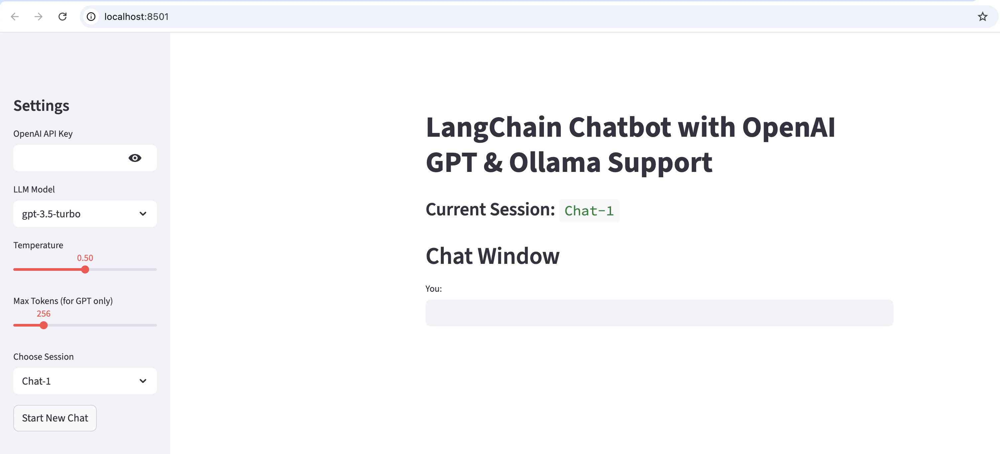

# LangChain Chatbot (OpenAI + Ollama)

## 🖼️ Demo Screenshot

Here’s what the chatbot looks like running in Streamlit:




This project is part of [Generative-AI-Projects](../).  
It is a **Streamlit chatbot** that supports both **OpenAI GPT models** (cloud) and **Ollama local models**.  
The assistant maintains **chat history with session IDs** so it remembers context across turns.

---

## ✨ Features
- Supports **OpenAI GPT** (`gpt-3.5-turbo`, `gpt-4`) and **Ollama** models (`gemma`, `llama2`, `mistral`, etc.)
- Session-based chat history (`Chat-1`, `Chat-2`, …)
- Memory: assistant remembers context in each session
- Configurable **temperature** & **max tokens**
- Simple UI with Streamlit

---

## Installation

Clone this repo and go into the project folder:
```
git clone https://github.com/vinit-devops/Generative-AI-Projects.git
cd Generative-AI-Projects/LangChain_Chatbot_OpenAI_Ollama
```
Create a virtual environment and install dependencies:
```
python -m venv venv
source venv/bin/activate    # Mac/Linux
venv\Scripts\activate       # Windows
pip install -r requirements.txt
```
🔑 Setup

Create a .env file in this folder with:
```
LANGCHAIN_API_KEY=your_langchain_api_key
LANGCHAIN_PROJECT=your_project_name
OPENAI_API_KEY=your_openai_api_key
```
⚠️ Do not commit .env to GitHub.

If using Ollama, make sure it is running:
```
 ollama serve
````
And pull your model:
```
ollama pull gemma:2b
```

▶️ Run the App
```
streamlit run app.py
```
Open http://localhost:8501 in your browser


📂 Project Structure
```
LangChain_Chatbot_OpenAI_Ollama/
│
├── app.py             # Streamlit chatbot app
├── requirements.txt   # Dependencies
├── README.md          # This file
└── .gitignore         # Ignore venv, cache, secrets
```
⚡ Example Usage
- Select GPT or Ollama model from the sidebar.
- Enter your OpenAI API key (if using GPT).
- Start chatting — the assistant remembers context per session.
- Create new sessions from the sidebar and switch between them..

