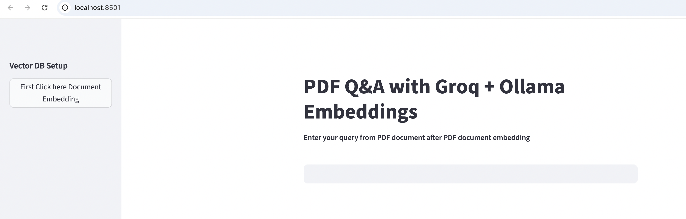

# 📄 PDF Q&A with Groq + Ollama Embeddings

## 🖼️ Demo Screenshot

Here’s what the app looks like running in Streamlit:



This project is part of [Generative-AI-Projects](../).  
An interactive **Streamlit** app that lets you upload and query PDF documents using **Retrieval-Augmented Generation (RAG)**.  
The app uses:

- **Groq LLMs** ⚡ for super-fast inference.  
- **Ollama embeddings** 🧩 to convert your PDF chunks into vectors.  
- **FAISS** 🔍 as the vector database for similarity search.  

---

## ✨ Features
- Upload PDFs and convert them into embeddings.  
- Persistent **FAISS vector database** (no need to re-embed every time).  
- Query PDFs in natural language.  
- Uses **Groq-hosted LLMs** for accurate answers.  
- Clean Streamlit UI with sidebar controls.

---

## Installation

Clone this repo and go into the project folder:
```
git clone https://github.com/vinit-devops/Generative-AI-Projects.git
cd Generative-AI-Projects/LangChain_Chatbot_OpenAI_Ollama
```
Create a virtual environment and install dependencies:
```
python -m venv venv
source venv/bin/activate    # Mac/Linux
venv\Scripts\activate       # Windows
pip install -r requirements.txt
```
🔑 Setup

Create a .env file in this folder with:
```
GROQ_API_KEY=your_groq_api_key
LANGCHAIN_PROJECT=pdf-qa-app

```
⚠️ Do not commit .env to GitHub.

Install & Run Ollama

```
ollama pull embeddinggemma:latest
```

▶️ Run the App
```
streamlit run app.py
```
Open http://localhost:8501 in your browser


📂 Project Structure
```
├── app.py # Main Streamlit app
├── context-pdf/ # Folder containing PDF documents
├── faiss_index/ # Saved FAISS vector database
├── .env # Environment variables (Groq API key, etc.)
├── requirements.txt # Python dependencies
└── README.md # Project documentation
```
⚡ Example Usage
- Select GPT or Ollama model from the sidebar.
- Enter your OpenAI API key (if using GPT).
- Start chatting — the assistant remembers context per session.
- Create new sessions from the sidebar and switch between them..
