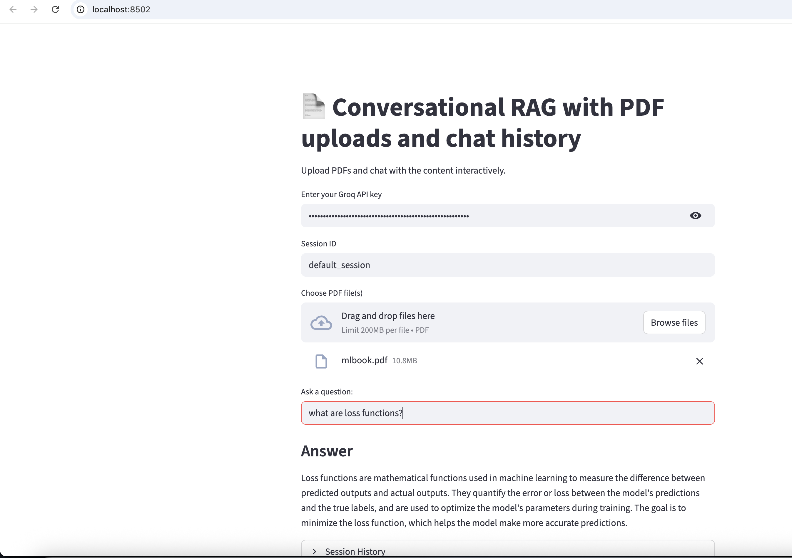

# 📄 RAG with PDF Uploads and Chat History

## 🖼️ Demo Screenshot

Here’s what the app looks like running in Streamlit:



This project is part of [Generative-AI-Projects](../).  
This project is an **upgraded version** of [LangChain_PDF_Groq_Ollama_Embeddings](../LangChain_PDF_Groq_Ollama_Embeddings).  
While the previous app focused on simple PDF Q&A using Groq (for LLM inference) + Ollama (for embeddings), 
this enhanced version introduces **conversational memory** and **multi-PDF support** for a more natural RAG (Retrieval-Augmented Generation) experience.  

The app uses:

- [Streamlit](https://streamlit.io/) – Interactive UI  
- [LangChain](https://www.langchain.com/) – RAG orchestration  
- [Groq](https://console.groq.com/) – Fast LLM inference (`llama-3.1-8b-instant`)  
- [HuggingFace Embeddings](https://huggingface.co/sentence-transformers/all-MiniLM-L6-v2) – Semantic search embeddings  
- [ChromaDB](https://www.trychroma.com/) – Vector database  
- [pypdf](https://pypi.org/project/pypdf/) – PDF text extraction 

---

## 🚀 What’s New in This Upgrade
- **Conversational Memory**: Keeps track of session history using `RunnableWithMessageHistory`.  
- **Chat Context Awareness**: Reformulates questions based on chat history (`create_history_aware_retriever`).  
- **Multiple PDF Uploads**: Upload and query multiple PDFs in the same session.  
- **Chroma Vector Store**: Uses [ChromaDB](https://www.trychroma.com/) instead of FAISS, optimized for conversational use.  
- **Streamlit UI Enhancements**:  
- Session IDs for tracking different conversations.  
- Expandable **session history** view.  
- Interactive sidebar for PDF uploads.
---

## Installation

Clone this repo and go into the project folder:
```
git clone https://github.com/vinit-devops/Generative-AI-Projects.git
cd Generative-AI-Projects/LangChain_RAG_PDF_Uploads_Chat_Historys
```
Create a virtual environment and install dependencies:
```
python -m venv venv
source venv/bin/activate    # Mac/Linux
venv\Scripts\activate       # Windows
pip install -r requirements.txt
```
🔑 Setup

Create a .env file in this folder with:
```
GROQ_API_KEY=your_groq_api_key
HF_TOKEN=your_huggingface_token

```
⚠️ Do not commit .env to GitHub.

Install & Run Ollama

```
ollama pull embeddinggemma:latest
```

▶️ Run the App
```
streamlit run app.py
```
Open http://localhost:8501 in your browser


📂 Project Structure
```
├── app.py # Main Streamlit app
├── .env # Environment variables (Groq API key, HF token)
├── requirements.txt # Python dependencies
├── README.md # Documentation
└── (optional) chroma/ # Persistent Chroma vector store

```
⚡ Example Usage
- Enter your Groq API key in the input field.
- Enter a session ID to separate conversations.
- Upload one or more PDFs.
- Ask questions in natural language.
- View answers and session history interactively.

🙌 Acknowledgements    
- Inspired by Krish Naik’s Generative AI course.
- Thanks to LangChain, Groq, and Hugging Face communities.
